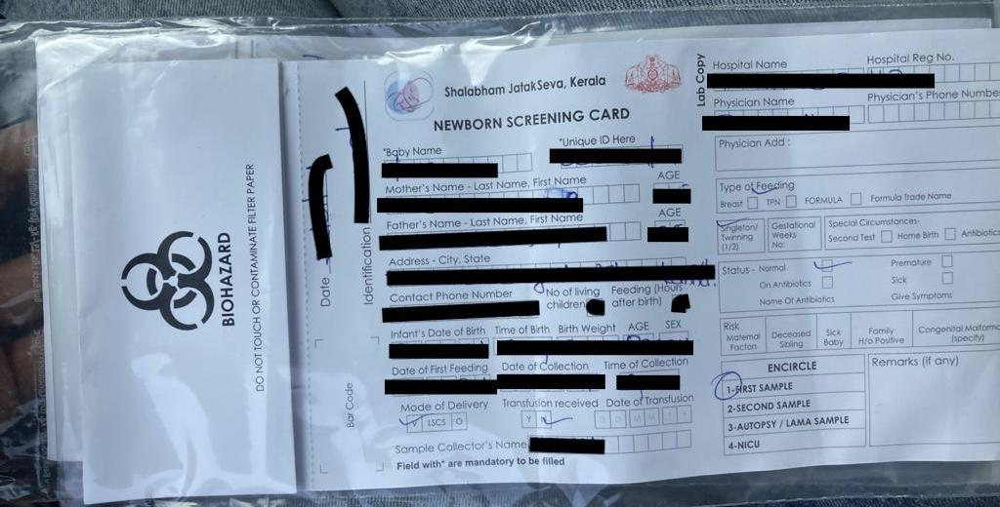
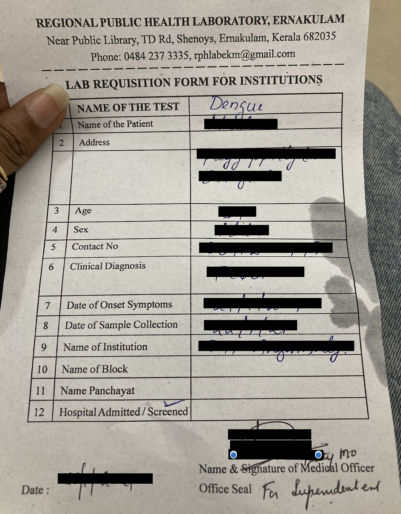
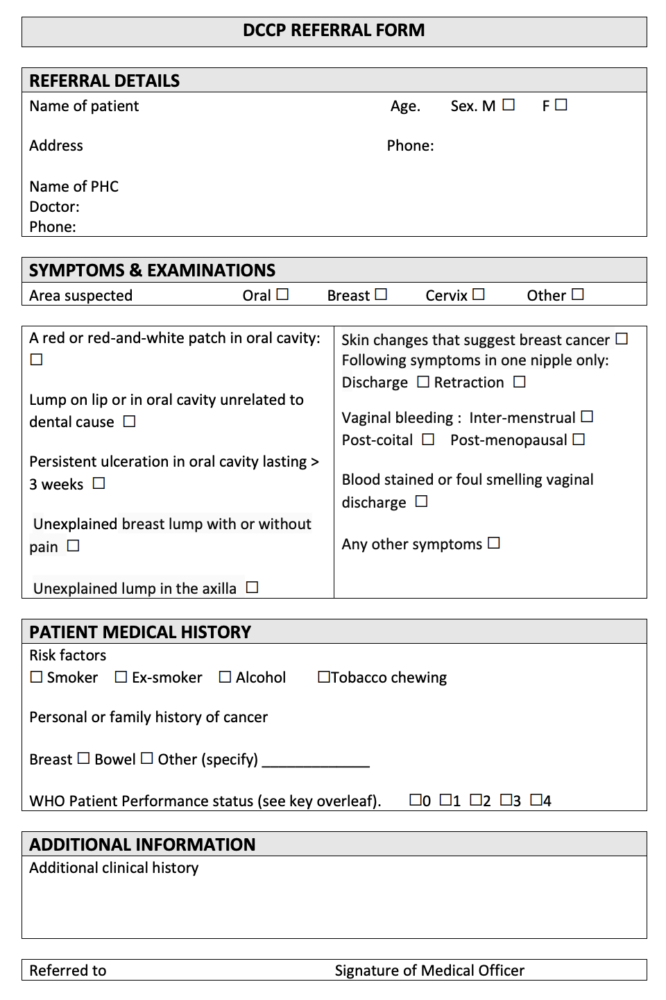
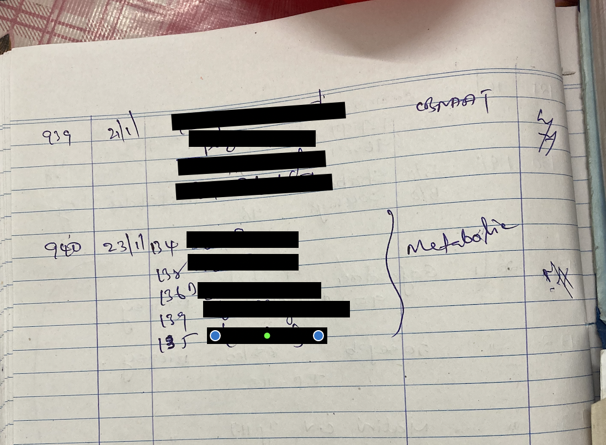
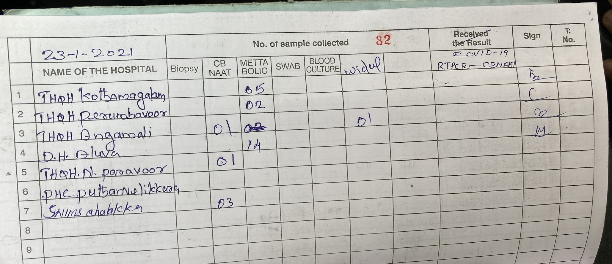
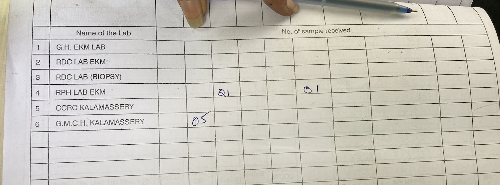

# Integrated Sample Management and diagnostic System

**Integrated Sample Management and Diagnostic System** was introduced in Ernakulam in 2019. The Sample Management and Diagnostic System comprises a network of sample collection centers \(the spokes\) and various testing centers \(Govt.Hospitals/labs\) \(the hubs\) and also the logistical system transporting the sample within this network. Result dissemination is also another facet of this Sample Management System.

On average around 10K Samples flow through the system every month.

### Terminology:

* **Spokes:** Spokes are the sample collection points spread all across the district. Each of these spokes collects one or more kinds of samples. These could be hospitals \(Govt./Pvt.\), Primary Health Centres, COVID Testing Centres etc.
* **Hub:** A hub is a testing centre where these samples are transported to and tested. Results for these tests are sent out from here following the various protocols to various kinds of tests. The following are the hubs currently included in the project.

1. General Hospital, Ernakulam
2. RDC Lab
3. RPH Lab
4. CCRC Kalamassery
5. General Medical College Hospital, Kalamassery

New hubs may be added or removed from this list depending on circumstances.

\(ABOVE: Example of a referral form for newborn metabolic screening\)

\(Example of the referral form sent with Widal Sample for dengue test\)

\(Example of the referral form for biopsy sample\)

### Current workflow of the System:

#### Sample Flow:

1. 5 vehicles are available in the system today. The number of vehicles may vary depending on the load.
2. Two vehicles operate for the collection of regular basis samples visiting 12 Major Government Hospitals to collect samples and other three vehicles for the collection of covid 19 samples and communicable diseases confirmation samples from private hospitals every day.
3. The vehicles start at 9 AM in the morning collecting samples from each of these 12 hospitals one after another and drop off all the collected staples to the hubs by 3 PM.
4. In addition to these 12 major hospitals, they also collect samples from other smaller spokes enroute, on call. There is one coordinator for the district \(Mrs. Honey\) who receives these pickup requests on call and decides on the route of the vehicles. Every week an average of 10 requests for pickup are placed in this manner.
5. Other spokes like PHCs manage to transport the samples by themselves to their respective CHCs from where the vehicle receives it.
6. The other 3 vehicles are allotted for COVID sample collection and other CD \(communicable diseases\) samples currently.
7. The 2 vehicles in the morning shift are used again in the evening in double shift on COVID sample collection if required.
8. In the same round trip, the vehicles also drop these samples to the hubs. There are separate hubs for different kinds of samples.
9. Each of these vehicles usually have a geographic area allotted to them within which they are responsible to collect all samples. The samples must be dropped off at the specified hub across the district.
10. Once picked up, the blood culture and metabolic Samples must reach the hub within 6 hours ideally. Special precautions like transporting the samples in Ice Boxes are taken if any delay is anticipated.

#### Logging System:

1. Each Sample is packed with a referral letter at the spoke.
2. The number of samples handed over to the vehicle is recorded in a register in the spoke where the driver puts his signature against the list of samples.

\(Example of Spoke outgoing register\)

1. Physical registers are maintained at each of the spokes, each of the vehicles and also at each of the hubs.Therefore there are 3 logs maintained:
   1. Spoke incoming and outgoing register. \(Smaller sample collection centers around a spoke will transport the samples to the spoke for transportation to the hub. Eg: PHCs around 18 CHCs are asked to transport the samples to the respective CHCs for pickup\)
   2. Vehicle incoming and outgoing register.
   3. Hub incoming and result intimation register.

\(Example of Vehicle Incoming register\)

\(Example of vehicle outgoing register\)

The register records entries for each time a sample moves from a spoke to the vehicle and from the vehicle to the hub and then once the result is communicated by the hub. \( pen and paper method\)

### Major shortfalls in the current system:

1. **Management of vehicles and coordination with Spokes and Hubs** is too cumbersome for the system coordinator \(Mrs. Honey\). The vehicles used may vary each day. Also the requirements for pickup at the spokes are also not steady and cannot be predicted. The number of hubs to visit, depends on the number and nature of the samples picked up. To make things more difficult, there are additional requests placed on call. Decisions with regard to which spokes to visit for doorstep pickups and which spokes are to transport the samples to a decided meeting point must be made by an individual, the system coordinator \(Mrs. Honey\).
2. **Promptness of pickup at the spoke** must be improved, especially in case of those spokes that are not regularly visited. They are expected to place pickup requests through phone calls. Sometimes these spokes also have to wait unreasonably long for the pickup. The spokes sometimes even have to transport the samples to the nearest meeting point which puts a lot of unreasonable stress on the staff at the spokes.
3. **Uniquely identifying the sample** is difficult without a unique tag. There is a high human error happening here. There have been many reports filed about missing samples, misplaced and misidentified samples. This detrimentally affects the efficiency of the system.
4. **Communication of results** is sent by the hub to the spokes from where it further reaches the patients. Various channels of communication and procedures are used to communicate the result from the hubs to the spokes and then to the patients. A more uniform and streamlined system of result dissemination would ease the work of the hubs and also makes the testing process more prompt to benefit the patient.

**Sources:** 

* Mrs. Honey, Staff of NHM and the system co-ordinator for the Sample Management System
* Mr. Manoj, Transportation Vendor and driver for the Sample Management System

## Proposed: CoronaSafe Sample Management System

This is a paperless tech-enabled system of sample management.

### User Profiles:

#### I: Staff at the spoke:

There are 3 major responsibilities of the staff at the spoke.

* Collecting and tagging the sample
* Receiving samples from nearby smaller spokes.
* Placing request for pick-up
* Handing over the samples to the vehicle.

Therefore the system facing the staff at the spoke must have the following:

1. A form to create/ register the spoke and add relevant information
2. A module to generate QR codes to uniquely tag the samples. Once a QR code is generated against a sample, all the patient details are hidden, or only visible to that particular sample collection point. Henceforth, in the workflow, the sample will only be identified by the QR code.
3. The form to be submitted for each sample must contain questions about type of sample, types of test to be conducted, and also about the shelf life of the sample, so that the system may take into account the urgency of drop, while suggesting a navigation route to the driver of the vehicle. Also, the system is already fed with the data of tests done in each of the hub, depending on the availability of testing facility and the geographic distance, the system automatically allots the destination. This destination is also printed on the label on the sample affixed by the staff at the spoke.
4. A module to record transfer to another \(bigger\) spoke from where the vehicle will collect the sample. Eg: a PHC will transfer the sample to the closest CHC from where a pickup request to the vehicle is placed.
5.  A module to aid in placing a request for pickup.This module should have a schedule of the trips run by the vehicles. The staff must be able to book for pickup in the desired vehicle while also mentioning the number of boxes to pick up.
6. Lastly, the staff at the spoke should be able to log the details of the samples inside each of these boxes. This step is authenticated when the vehicle driver confirms the receipts of the samples through their interface.
7. The staff must also have access to the history of the logs specific to the spoke.The log must also display the current status of the sample. The result of the tests concerning them must be visible to them, as updated by the staff at the hub.
8. The staff at the spoke must be able to raise concerns about a pick-up vehicle/driver. This concern will be visible to only the transportation vendor and the system administrator.

#### II: Vehicle Driver:

The work of a vehicle driver involves 3 main facets.

* Navigating through the most effective routes to cover all stops \(for pick-up and drop\)
* Receiving the correct samples and dropping them off at the designated hubs.
* Promptness of delivery.

Therefore the system facing the vehicle drivers must have the following:

1. Depending on the requests received by the system from the spokes, the system should compute and come up with the most efficient route to follow to pick up all the samples and drop them. The shelf life of the samples mentioned by the staff at spoke will also be a factor in deciding the route map.
2. The system must aid the driver to navigate the route while continuously logging the information of the trip, through GPS technology.
3. Upon reaching a spoke, the driver must receive the details of the outgoing boxes entered by the staff at the spoke, verify the information received by examining the boxes of samples \(or by simply scanning the QR code on the boxes and samples and allow the system to compare it to the information scanned by the staff at the spoke\) and authenticate that the identified boxes of samples are indeed handed over to the vehicle. Any mismatch in the information recorded by the driver and the staff will raise a red flag immediately.
4. Similarly, at the hub, the driver again shares the list of the Boxes and samples \(preferably by scanning the QR code\) and hands over the boxes to the staff at the hub who in turn authenticates that the identified boxes and samples have indeed been handed over to the hub.
5. There must be an option for the driver to ask for a backup vehicle at any point in a live trip, in case of any mechanical issue or accidents. The driver must be able to immediately call a back-up vehicle so that the sample reaches the hubs on time. All the information visible to the driver about the route and the samples must now be visible to the back-up driver, once he has reported to the location for the transfer of charge.

#### III: Transportation Vendor :

The transportation vendor is the person who undertakes to supply the pre-decided number of vehicles of the agreed kind to the National Health Mission for transportation of the samples.

* Their only responsibility is to make available the right kind of vehicle for the task and pass along the information of such vehicle to the system.

Therefore the system facing the vendor will show

1. The requirement for vehicles on that particular day \(there can be a cap for maximum number of vehicles available, to be set by the system administrator depending on the contract for service they have with the vendor\),
2. The vendor can register the vehicles available and the drivers available separately to their interface.
3. The vendor issues the user credentials to the drivers at the time of registration of the driver.
4. Assign vehicle and driver for the trips each day. A schedule of cars and drivers may be set as a default option. These details may be edited till each trip actually goes live.
5. The details of the car and the driver are made visible by the system to the staff at the concerned spoke/hub.
6. A log of all trips undertaken must be available to the vendor.
7. The vendor must have access to the concerns filed by the staff at the spokes/hubs and must also respond to the concerns. If many concerns are filed about the vehicle/driver of a particular vendor, he may be blacklisted, at the discretion of the system administrator.
8. The vendor will be intimated when a driver has asked for a back-up vehicle. A call is placed between the driver and the vendor to understand the issue. The vendor, if needed, immediately assigns a registered driver and vehicle as the backup vehicle and sends the backup vehicle. The system shares the driver access for that particular trip with the back-up driver.

#### IV: Staff at the Hub:

The staff at the hub has the following responsibilities:

* To receive the correct samples from the vehicle and log the information
* Update the result into the system after testing.

Therefore the system facing the staff at the hub must have the following features:

1. A form to register a hub and add all relevant details including location and kinds of testing done and scale of operation.
2. Scan QR code of the incoming samples to authenticate receipt of the correct samples from the vehicle driver.
3. Update the status of the test.
4. Upload the result of the test to the system. The result must be available to all concerned parties.
5. The staff must also have access to the history of the logs specific to the hub.The log must also display the current status of the samples.
6. The staff at the hub must be able to raise concerns about a pick-up vehicle/driver. This concern will be visible to only the transportation vendor and the system administrator.

#### V: System Administrator:

* There shall be one system administrator at a district level. The district administrator will have access to all the logs at all the hubs and spokes \(all information except result will be visible\) in the district, as well as the logs from vehicles.
* The system administrator will see all the concerns filed against the transportation vendors, and shall have decision making powers in blacklisting a vendor.
* The system administrator will be the individual deciding on the terms with the vendors. The system administrator will also update the total number of vehicles available.
* The system administrator issues login credentials to the first staff of any hub/spoke and the transportation vendor. For the second staff in the hub/spoke, the first staff would be able to create user credentials of the access level: STAFF. The vendors will in turn create the user credentials for the drivers \[ **NOTE:** This is the model in CARE\]

### Infrastructural Requirements:

* **At the Hub/spoke:**

1. Each hub/spoke must have a computer with a good internet connection to access the web based application.
2. There must be a printer to generate labels at the spokes that must be affixed to the packed sample.
3. There must be a device to scan QR Codes.
4. A staff trained in the use of computers.

* **For transportation:**

1. A smartphone with GPS, internet connection and camera that can scan QR Codes.
2. A phone charging system in the vehicle to charge the smartphone.

### 

### Implementation Strategy

The tool is to be developed and implemented in Phases.

#### Phase 1:

The first version to be rolled out is the system that communicates the number of samples to be picked up and dropped at each facility. The users to this would be the Spokes, Vehicles, Hubs and the system administrator.

#### Phase 2:

In the second phase we will introduce the feature to uniquely identify samples.

Result dissemination may also be added at this stage.

#### Phase 3:

Here, the map feature will be introduced to optimise the navigation and route of the drivers. The role of the vehicle vendor may also be introduced for vehicle management.

### Wire Frame for the tool:

The draft wireframe for the tool is available at,

[https://drive.google.com/file/d/1oWGG1fJ-5B73vzmANjirJ8fyw9NmD-Q6/view?usp=sharing](https://drive.google.com/file/d/1oWGG1fJ-5B73vzmANjirJ8fyw9NmD-Q6/view?usp=sharing)

#### 

