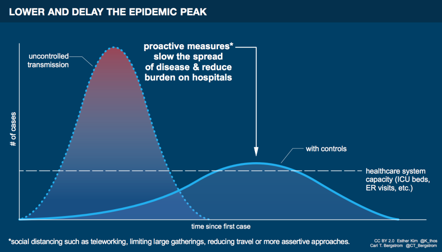

# Covid 19 Spread Modelling

**Goal:** To create a data driven decision-making framework for public authorities to actively intervene and manage the spread of COVID19 outbreak.

COVID-19 cases will soon explode into unprecedented levels and we need to flatten the epidemic curve to reduce the burden on our current healthcare system. In order to facilitate effective response, we require our data-science volunteers to help us model the epidemic curve for COVID-19.

> "To minimize the impact of the coming pandemic, we need to slow its spread and thereby keep our healthcare systems from being overwhelmed. Through aggressive measures we can flatten out the epidemic curve, keeping the number of people simultaneously infected at a low enough level to be manageable." - **Carl Bergstorm, Professor of Biology, University of Washington**

> “If you look at the curves of outbreaks, they go big peaks, and then come down. What we need to do is flatten that down.” - **Anthony Fauci, Director of the National Institute of Allergy and Infectious Diseases**

## Tentative Task List

* [ ] Create \(overall and by segment\) evolution curves for COVID-19 cases with confidence intervals
  * [ ] By Geographical sub-regions of state
    * [ ] North
    * [ ] Middle
    * [ ] South
  * [ ] By Case severity
    * [ ] Needs ICU \(Critical\)
    * [ ] Needs Hospitalization \(Moderate\)
    * [ ] Stay at Home\(Mild\)
  * [ ] By age group
    * [ ] &lt;50 yrs
    * [ ] 50 - 80 yrs
    * [ ]  &gt; 80 yrs
* [ ] Evolution curves  will be used for decisions related to capacity planning
  * [ ] Predict estimated time to breach of capacity from current day
    * [ ] ICU Capacity
    * [ ] Hospital Beds
    * [ ] Medical supplies
  * [ ] How fast is COVID-19 outbreak growing?
  * [ ] How many cases should we expect in next days/weeks?
* [ ] Plan the prioritization of hospital supplies/facilities to diffuse crowding
* [ ] Predict when COVID-19 cases peak and start receding
* [ ] Identify current phase of the outbreak

## Dataset Specs \(In Progress\)

Requirements for data collection from each location for modelling purpose

1. Current Hospital Capacity Data
   1. Require current available hostpital beds in each location
   2. Require current available ICU capacity for each location
2. Estimate of supplies needed to treat **one** person in
   1. Critical condition who needs an ICU bed
   2. Moderate condition who needs a hospital bed
   3. Mild or Stay-at-home condition
   4. List of items require to treat a person
3. Mandatory Patient Data to be collected while admitting
   1. Day of occurence of symptoms
   2. Admission date
   3. Dates of exposure / infection
   4. Severity of condition - Critical/Moderate/Mild
   5. Dates of outcome: death / recovery
   6. Metadata on patient: age, gender, location, occupation, etc
   7. Contact data: exposure \(who infected you?\) and Contact tracing \(who could you have infected?\)

## Data Scientist Learning Resources \(In Progress\)

* [https://www.reconlearn.org/](https://www.reconlearn.org/)
* [How to install R and R-Studio](https://courses.edx.org/courses/UTAustinX/UT.7.01x/3T2014/56c5437b88fa43cf828bff5371c6a924/)

## TODO

* [x] We need to issue call for Data Scientists
* [ ] We need to collect dataset of reported cases
* [ ] We need to identify appropriate dataset to be passed to multiple teams for modelling
* [ ] Consult with SME to identify suitable geographical granularity at which epidemic curves needs to be created
* [ ] Create predictive models with Data Scientists
* [ ] Apply this to a spatial data set and visulize future projections 
* [ ] Hypotheses testing of "what-if" scenarios

\*\*\*\*

